# Using GordianSigner

*GordianSigner* allows you to: sign a PSBT, import & managing your accounts, fill & export account map and save contacts.
This instructions show how to use these basic features.

## Singing a PSBT

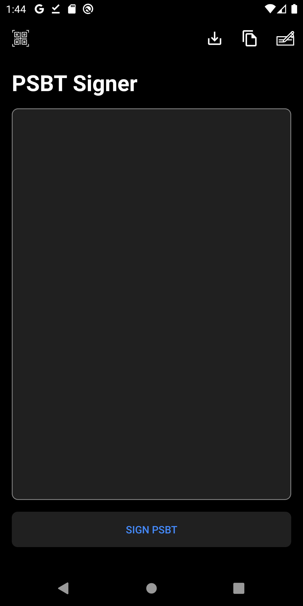 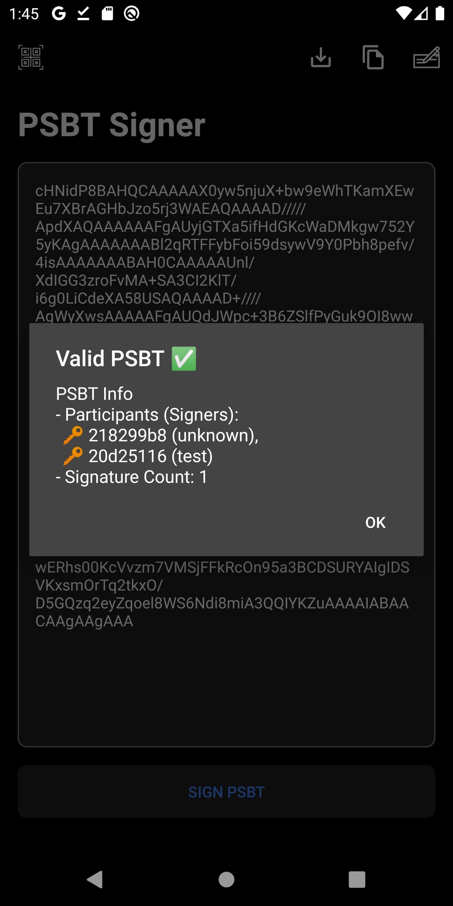

You can import a PSBT to sign by pasting from clipboard, importing from file or scanning UR code.

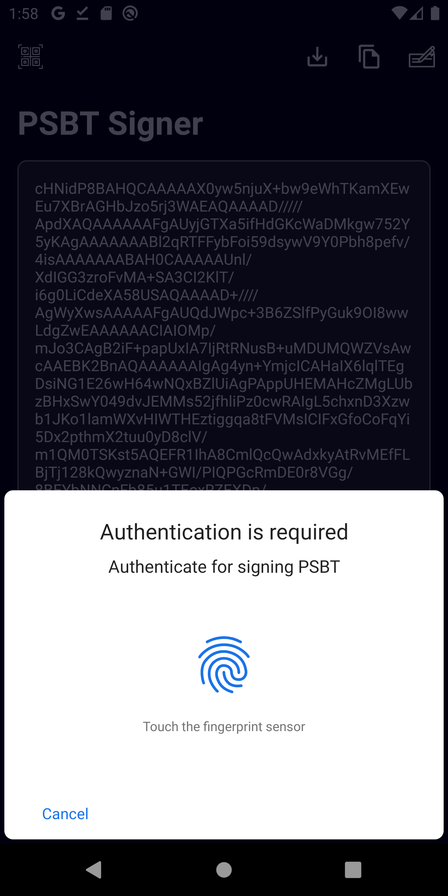 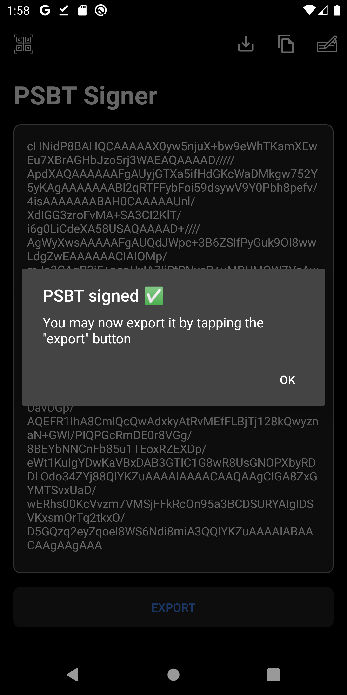

Once you imported a valid PSBT, you can authenticate and sign your PSBT with your saved key or import an account to sign.

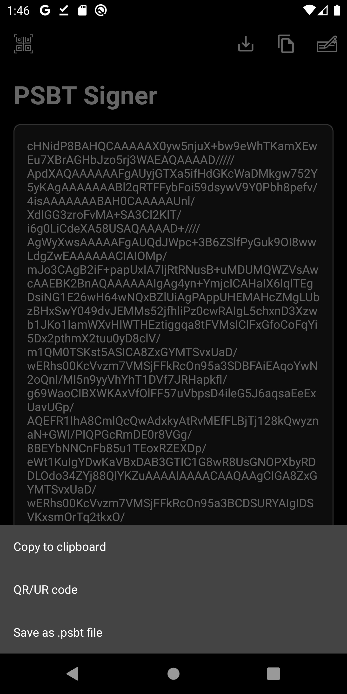 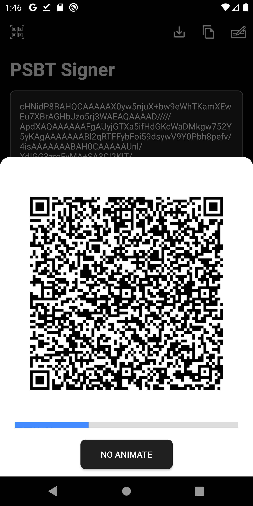

After sign successfully, you may export the PSBT as multiple formats such as UR, file or copy to clipboard.

## Managing accounts

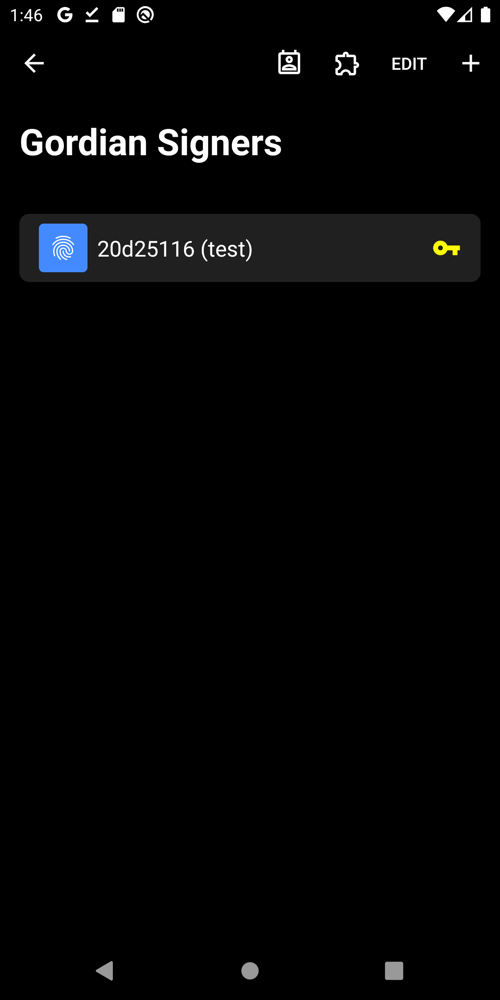 

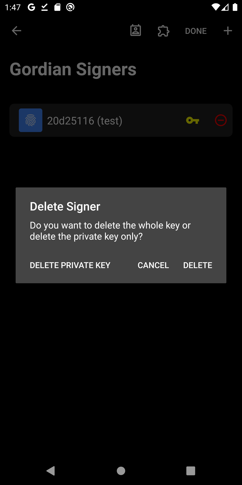 

You can see all your saved accounts here and you are able to edit the name, delete the account or remove the private key from device.

## Creating an account

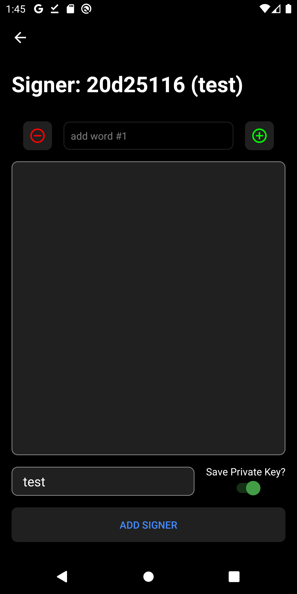 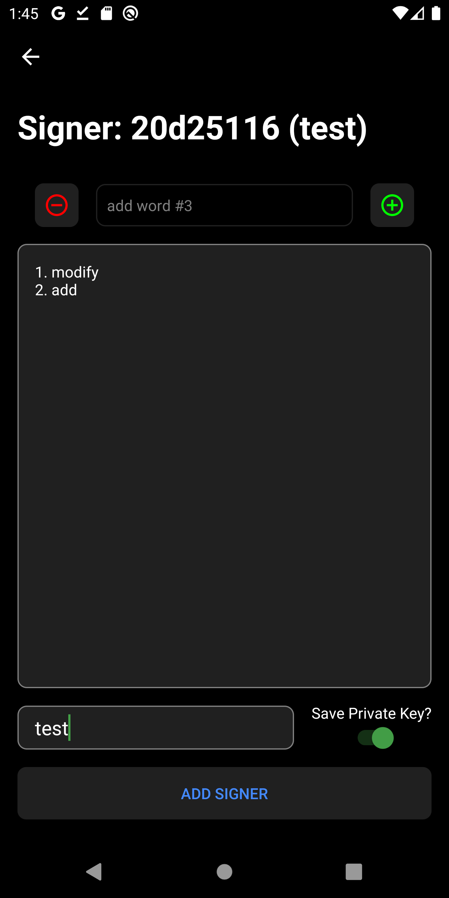 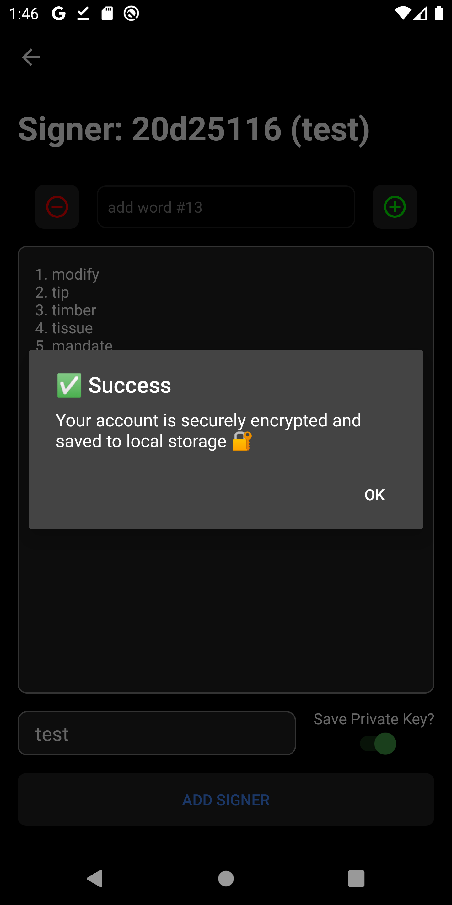

By inputting your 12 recovery words, you can import your account to your phone. You may save it with memorable alias and with optional save private key on the device or not.

## Fill an account map

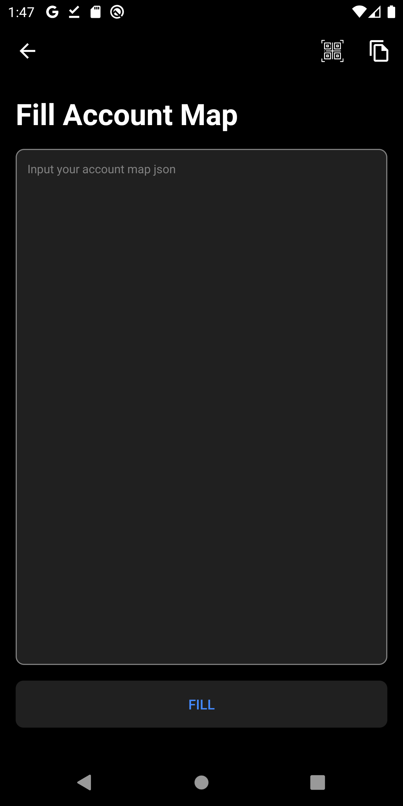 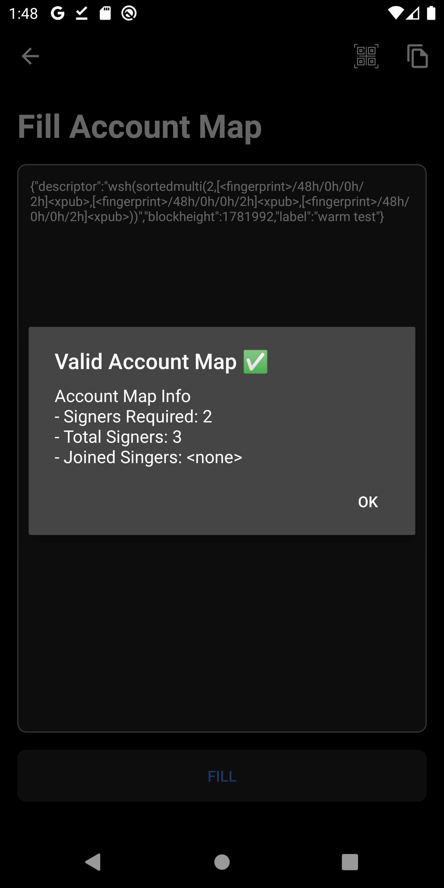

You can import an account, the app will check whether it is valid or not and show its information

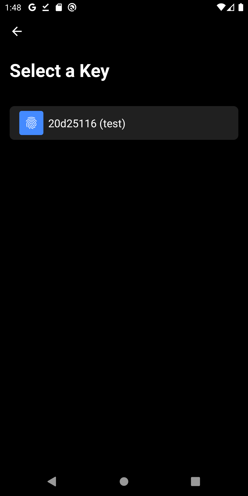 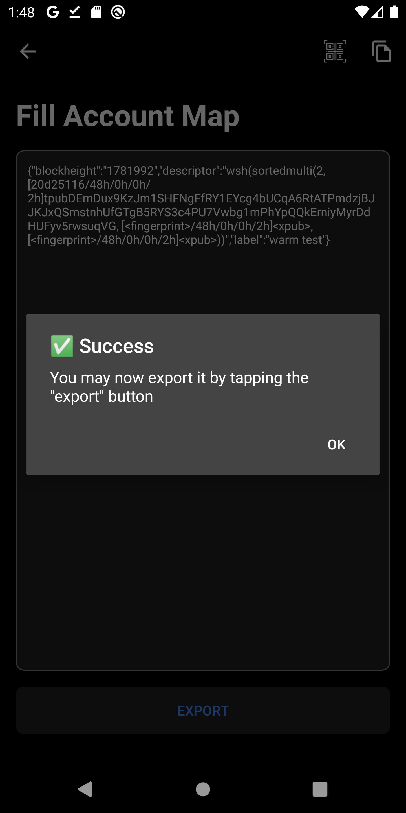

After review the account map you might fill it by choosing an appropriate account

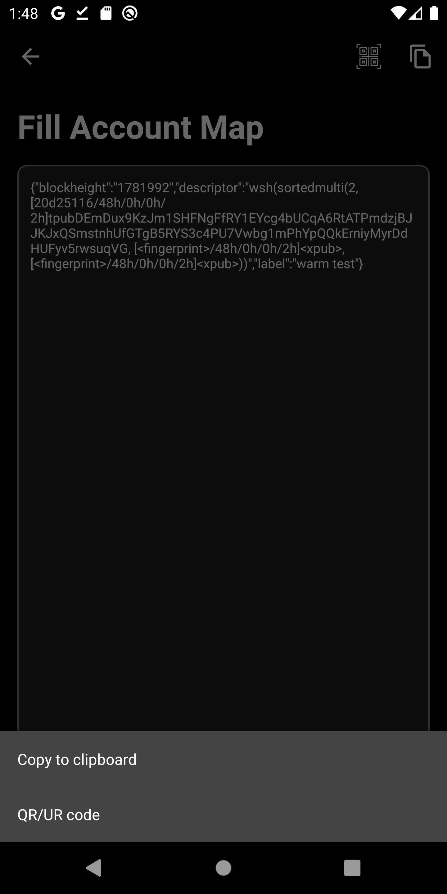 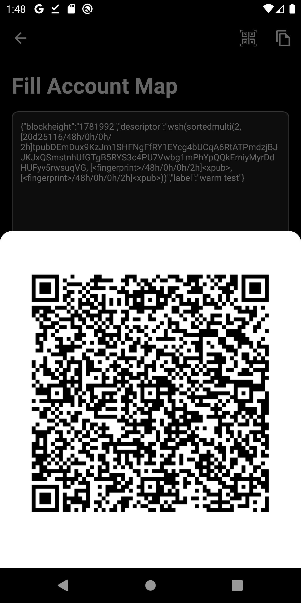

Then you can export as QR or copy to clipboard

## Managing contacts

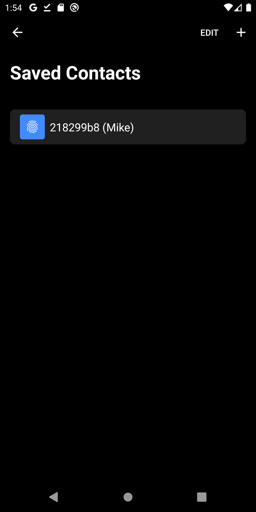 

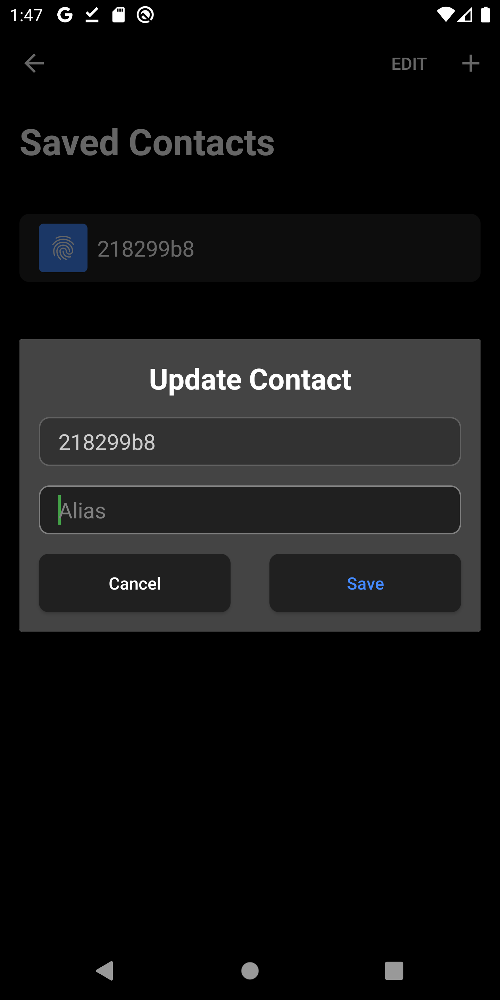 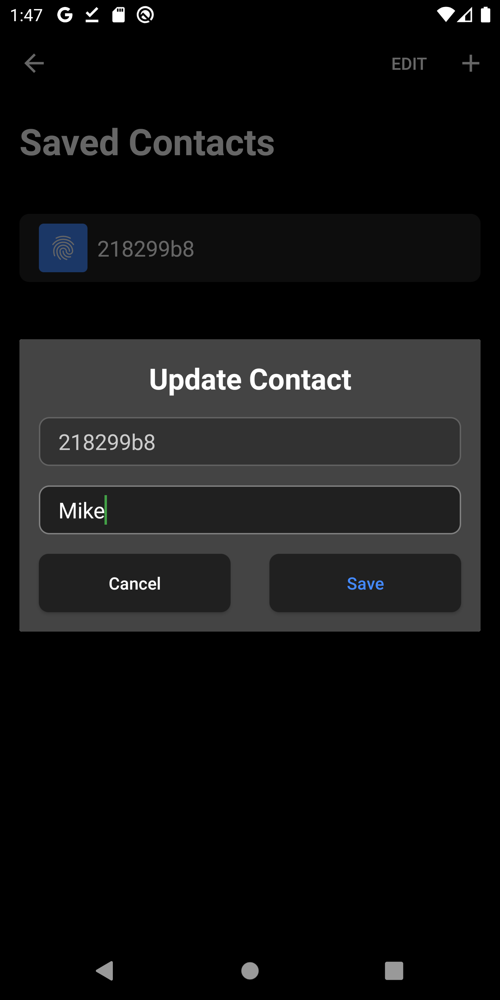

Other signers accompany with the PSBT you have signed or Account Map you have filled will be saved in your contacts. In this screen, you can manage your contacts by renaming or adding/removing contacts.